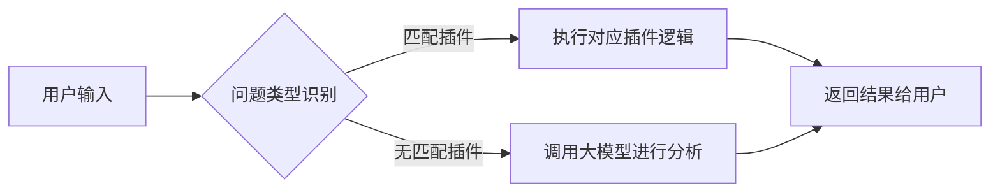

# AI 分析系统架构对比说明文档

本文基于参考文档「AI分析系统架构深度对比分析报告」，详细对比了以下两种主要的 AI 分析系统架构：
1. 基于规则 + 插件的混合架构
2. 纯大模型推理架构

内容包含两种架构的流程图、基本实现方式以及各自的优劣分析，帮助读者根据业务场景选择最适合的解决方案。

---

## 一、基于规则 + 插件的混合架构

### 1. 架构简介

在该架构中，系统通过一个“智能路由”或“问题类型识别”模块先对用户输入进行解析，再根据特定的业务规则和插件进行分析；若不匹配任何插件，则调用大模型进行通用推理。该方式充分发挥了预定义插件的可控性和大模型的灵活性。

### 2. 流程图

### 3. 基本实现方式

- **核心组件：**  
  1. 智能路由：基于关键词或模式识别技术，对问题进行快速分类。  
  2. 插件系统：为不同类型的分析场景（学生分析、班级分析、历史对比等）提供预先编写的业务逻辑。  
  3. 大模型补充：当无法匹配任何插件或超出插件范围时，调用大模型做自然语言理解与解答。

- **实现示例：**
  - 问题分类函数：对问题进行关键词或规则匹配，返回对应的插件或调用大模型的指令。
  - 插件：每个插件封装一类分析逻辑，例如统计平均分、生成特定报表等。
  - 大模型接口：接收通用性问题，将问题文本发送给大模型并解析返回结果。

### 4. 优劣分析

| 方面                   | 优势                                                         | 劣势                                                                     |
|----------------------|------------------------------------------------------------|------------------------------------------------------------------------|
| **准确性和可控性**      | 预定义逻辑可针对特定业务需求实现高精度结果，插件输出可预测   | 需要维护大量规则和插件逻辑，新增或修改业务需求时需要编写额外代码                                         |
| **性能**               | 插件执行通常只需 CPU 计算，效率较高，响应速度快              | 适应性较差，无法简单处理未预见的问题或新场景，一旦超出插件覆盖范围就需调用大模型                             |
| **成本**               | 运行成本可控，无需频繁使用 API 调用或额外 GPU 资源           | 人力成本较高，需不断完善、调试和维护插件                                                    |
| **专业性和定制化**       | 能够整合专业的业务模型、算法或统计思路，满足深度分析需求       | 自然语言理解能力相对有限，依赖业务规则实现                                                 |

---

## 二、纯大模型推理架构

### 1. 架构简介

该架构下，用户的问题输入会直接交由大模型进行解析与推理，不再依赖复杂的插件或业务规则。通过单一或多大模型的协同分析，实现对多种类型问题的统一处理。

### 2. 流程图

### 3. 基本实现方式

- **核心组件：**  
  1. 大模型：负责接口对话和推理，支持复杂自然语言处理和多轮上下文交互。  
  2. 问题与上下文管理：根据用户问题和历史上下文，构建提示词(Prompt)传递给大模型。  
  3. API接口：将结果返回给应用端或进行二次处理（可选）。

- **实现示例：**
  - 所有问题均发送给大模型接口（如 OpenAI、内部 LLM 等）。
  - 由大模型针对上下文进行推理分析，最后返回可读性结果或半结构化数据。
  - 可在应用层做基础的后处理操作，例如结果格式化或评估模型输出的置信度。

### 4. 优劣分析

| 方面                       | 优势                                                                      | 劣势                                                                                                           |
|--------------------------|-------------------------------------------------------------------------|--------------------------------------------------------------------------------------------------------------|
| **智能化程度**              | 自然语言理解优秀，适应性强，可处理多种场景和复杂问题，易扩展                                    | 结果的不确定性和不透明度较高，可能出现幻觉（生成不准确或虚假信息），且同一问题可能产生不同答案                                      |
| **灵活性**                 | 所有类型的问题都可以直接通过自然语言交互完成，无需预定义规则或插件                                  | 每次分析都需要调用大模型服务，运行成本相对较高，且响应速度依赖外部接口或 GPU 资源                                                         |
| **创新性**                 | 有机会产生超越预期的见解和分析角度                                                                 | 缺乏对特定领域专业指标的丰富理解，需要附加专业知识或提示词才能得到高质量结果；对算法过程不透明，难以 debug 或验证                         |
| **维护与升级**               | 大模型升级后可直接获得更强的推理和理解能力                                                           | 必须确保数据隐私与安全，企业数据在外部大模型上处理可能存在合规和保密风险                                                              |

---

## 三、总结建议

- **混合架构** 更适用于对结果准确度、可控性要求较高，同时存在明确业务逻辑或统计报表需求的场景；  
- **纯大模型推理架构** 更适用于对灵活性与创新性要求较高、希望尽可能减少手工配置的场景，但在稳定性和推理一致性方面需要更多评估。

在实际应用中，往往将两种方式进行“二元组合”，利用插件负责关键业务逻辑和验证，大模型负责自然语言解析与补充分析，从而在系统性能与智能程度之间取得平衡。